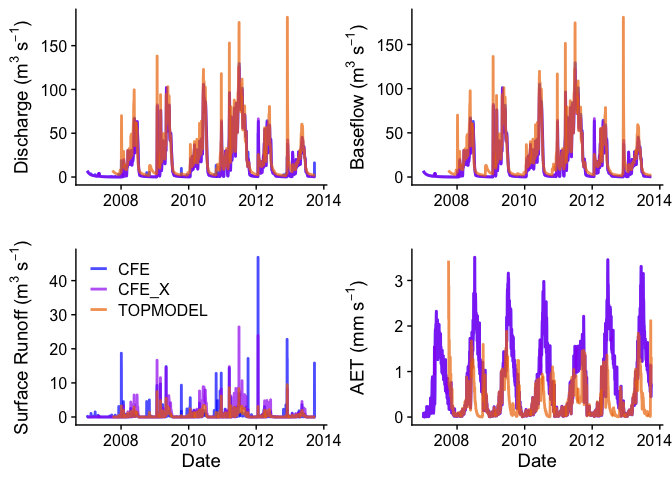

Analysis of Coupled Snow-Runoff Models
================
Keith Jennings
2022-11-17

# Introduction

A few quick plots showing different output data from a coupled snow
modeling experiment in the Sierra Nevada using the Next Generation Water
Resources Modeling Framework.

# Get the data

Run the following code chunk to summarize the output data from 3 NextGen
runs.

``` r
# Load packages
library(tidyverse)
```

    ## ── Attaching packages ─────────────────────────────────────── tidyverse 1.3.2 ──
    ## ✔ ggplot2 3.3.6     ✔ purrr   1.0.2
    ## ✔ tibble  3.2.1     ✔ dplyr   1.1.3
    ## ✔ tidyr   1.3.0     ✔ stringr 1.5.1
    ## ✔ readr   2.1.4     ✔ forcats 0.5.2
    ## ── Conflicts ────────────────────────────────────────── tidyverse_conflicts() ──
    ## ✖ dplyr::filter() masks stats::filter()
    ## ✖ dplyr::lag()    masks stats::lag()

``` r
library(cowplot); theme_set(theme_cowplot())

# Uncomment the source function if running the summary script
# source("data_summarize.R")
df <- readRDS("baseline_vars_dly_summary.RDS")

# Add a path to save figures
plot_path = "figures/"
```

# Plot the data

``` r
# Make a color scheme
color_scale <- scale_color_manual(name = "Source", 
                                  breaks = c("CFE", "CFE_X", "TOPMODEL"),
                                  labels = c("CFE", "CFE_X", "TOPMODEL"),
                                  values = c("blue", "purple", "darkorange2"))

# Make a linetype scale
linetype_scale <- scale_linetype_manual(name = "Source", 
                                  breaks = c("CFE", "CFE_X", "TOPMODEL"),
                                  labels = c("CFE", "CFE_X", "TOPMODEL"),
                                  values = c("dotdash", "dashed", "dotted"))


# Add function levels to df to control plotting order
df <- df %>% 
  mutate(source = factor(mod, levels = c("CFE", "CFE_X", "TOPMODEL")))


# Plot all
baseline_vars_plot <- 
  plot_grid(
    ggplot(df, aes(date, qout_cms, color = source)) + 
      geom_line(lwd = 1, alpha = 0.7) +
      color_scale + 
      labs(x = "Date", y = expression("Discharge ("*m^3*" "*s^-1*")")) +
      theme(legend.position = "none",
            axis.title.x = element_blank()),
    ggplot(df, aes(date, baseflow, color = source)) + 
      geom_line(lwd = 1, alpha = 0.7) +
      color_scale + 
      labs(x = "Date", y = expression("Baseflow ("*m^3*" "*s^-1*")")) +
      theme(legend.position = "none",
            axis.title.x = element_blank(),
            axis.text.x = element_text(hjust = 0.65)),
    ggplot(df, aes(date, surface_runoff, color = source)) + 
      geom_line(lwd = 1, alpha = 0.7) +
      color_scale + 
      labs(x = "Date", y = expression("Surface Runoff ("*m^3*" "*s^-1*")")) +
      theme(legend.position = c(0.05, 0.8),
            legend.title = element_blank()),
    ggplot(df, aes(date, aet, color = source)) + 
      geom_line(lwd = 1, alpha = 0.7) +
      color_scale + 
      labs(x = "Date", y = expression("AET (mm "*s^-1*")")) +
      theme(legend.position = "none",
            axis.text.x = element_text(hjust = 0.65)),
    ncol = 2, align = "hv"
  )
# Save plot
save_plot(plot = baseline_vars_plot, filename = paste0(plot_path, "baseline_vars.png"), 
          base_height = 5, base_width = 10)

# Show plot
baseline_vars_plot
```

<!-- -->
